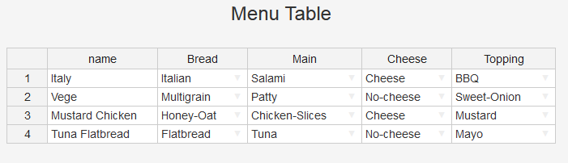

[Click here to go to the app]("https://hornedrat.shinyapps.io/ShinyConjointAppDDP/")

```{r setup, include=FALSE}
knitr::opts_chunk$set(echo = FALSE)
library(plotly)
library(tidyr)
library(dplyr)
library(webshot)
library(knitr)
```

## What the app does

The application simulates the choices of customers of a sandwich shop.
It is based on results of a [conjoint study]("https://en.wikipedia.org/wiki/Conjoint_analysis"). The study provided us with information
about the preferences towards sandwiches of a sample of over 700 people.


The application presents the preferences of customers, given a menu.

```{r, out.width="100%"}

```


## Simulations
<font size="4">The user can change the menu any way they want. The app allows to:</font>

<font size="3">

- Change the value of any attribute (eg. changing type of bread, main ingredient etc.)
- Add a new, user-defined product
- Delete a product

</font>


```{r fig.height=3}
load("preference")

p <- plot_ly(preference,
             labels = ~Product,
             values = ~pref,
             type = 'pie') %>%
        layout(title = 'Sandwich preference')

p
```
<font size="3">
The program simmulates the changes and shows how the preferences adapt to the new menu.
For example, user can see if their new sandwich would be a success, and how clients would switch
from existing sandwiches to the new one
</font>

## Business Applications

The application can be a useful tool for business management. It allows to:

- Simulate changes in a business portfolio
- Estimate appeal of new products to be included
- Simulate the effect of removing a product from a menu
- Optimizing the portfolio to generate larger return on investment

## Thank You

For more information about the app, please contact the author, [Jakub Wiatrak](https://github.com/HornedRat/).  


For further information about conjoint analysis methodology, see [this page](https://en.wikipedia.org/wiki/Conjoint_analysis).  

[*Click here to go to the app*](https://hornedrat.shinyapps.io/ShinyConjointAppDDP/)

